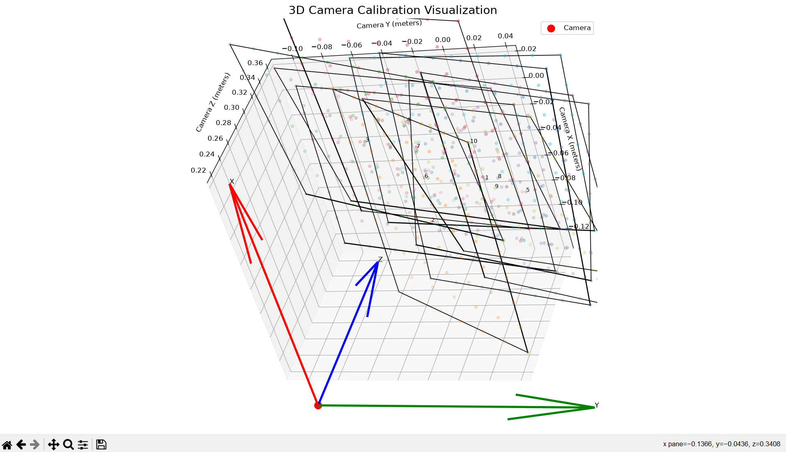

# picamera-calibration-with-Raspberry-Pi-3B-OV5647-camera
 debug.py file help you with image what is actual orinetion of chessboard and follow that orinention in the calibrateion of code like 6,9 or 7,9

#camera clibration output:
